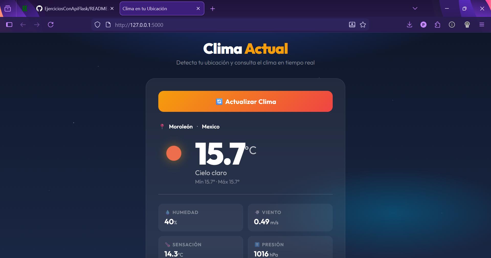
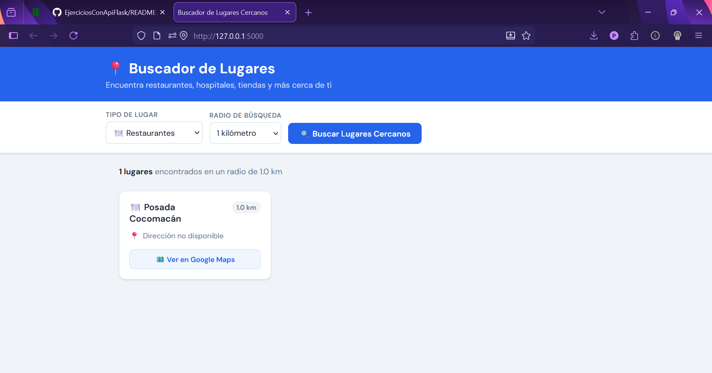
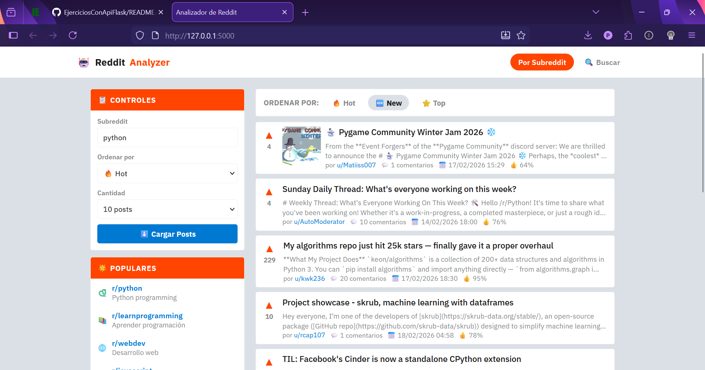
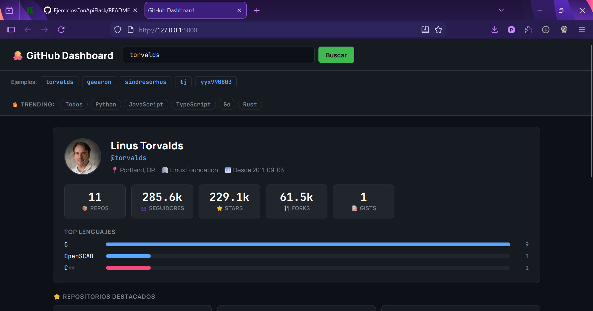
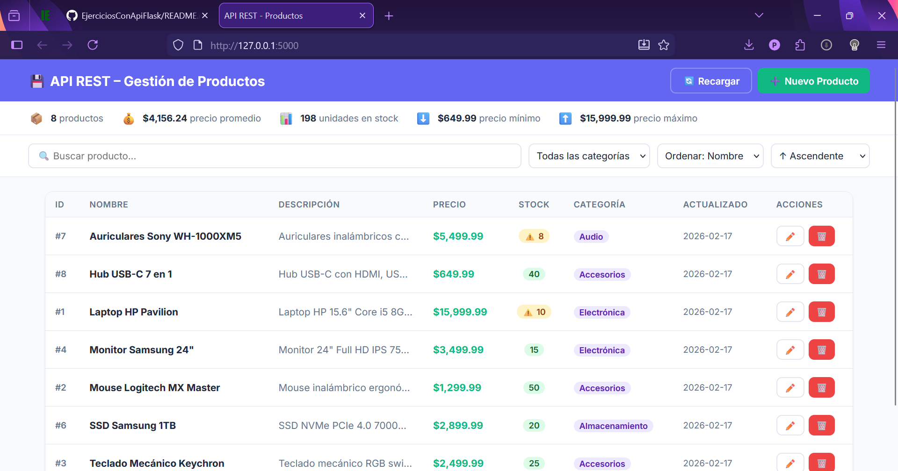
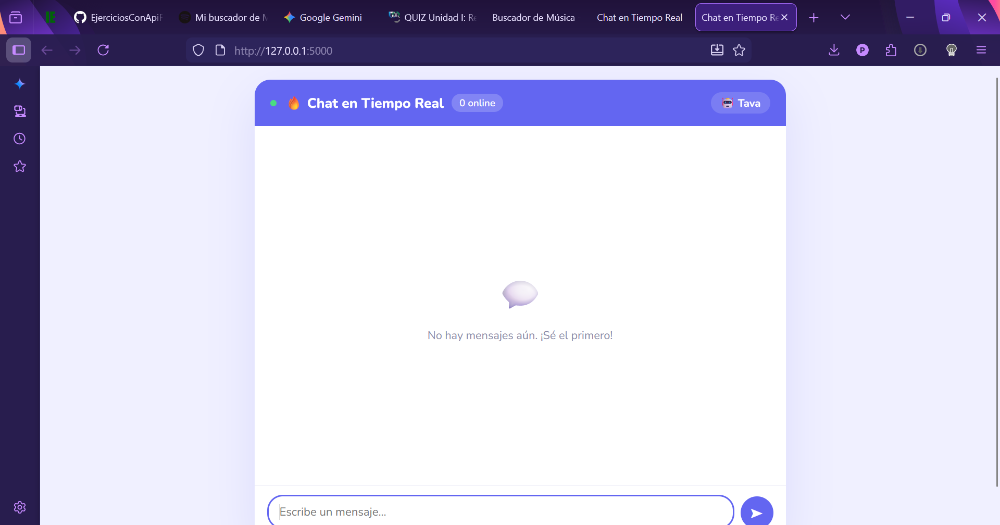
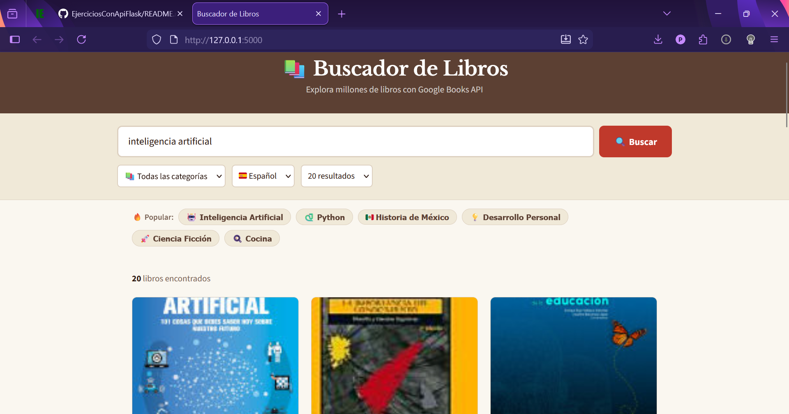
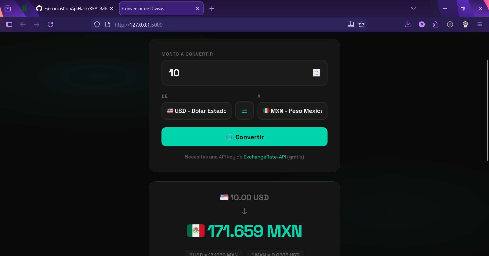

# 🚀 Ejercicios Prácticos de APIs con Flask

**Colección de 8 aplicaciones web completas usando Python Flask y diferentes APIs públicas**

## 🎯 Ejercicios

| # | Proyecto | Backend | Frontend | Descripción |
|---|----------|---------|----------|-------------|
| 1.1 | 🌍 Clima | [clima_app.py](ejercicio_1_1/clima_app.py) | [clima.html](ejercicio_1_1/templates/clima.html) | Detecta ubicación y muestra clima actual |
| 1.2 | 📍 Lugares | [lugares_app.py](ejercicio_1_2/lugares_app.py) | [lugares.html](ejercicio_1_2/templates/lugares.html) | Encuentra lugares cercanos (restaurantes, hospitales) |
| 2.1 | 🤖 Reddit | [reddit_app.py](ejercicio_2_1/reddit_app.py) | [reddit.html](ejercicio_2_1/templates/reddit.html) | Explora subreddits y busca posts |
| 2.2 | 🐙 GitHub | [github_app.py](ejercicio_2_2/github_app.py) | [github.html](ejercicio_2_2/templates/github.html) | Dashboard con estadísticas de usuarios/repos |
| 3.1 | 💾 CRUD API | [productos_api.py](ejercicio_3_1/productos_api.py) | [productos.html](ejercicio_3_1/templates/productos.html) | API REST completa con SQLite |
| 3.2 | 🔥 Chat | [chat_app.py](ejercicio_3_2/chat_app.py) | [chat.html](ejercicio_3_2/templates/chat.html) | Chat en tiempo real con Firebase |
| 4.1 | 📚 Libros | [libros_app.py](ejercicio_4_1/libros_app.py) | [libros.html](ejercicio_4_1/templates/libros.html) | Buscador de millones de libros |
| 4.2 | 💰 Divisas | [divisas_app.py](ejercicio_4_2/divisas_app.py) | [divisas.html](ejercicio_4_2/templates/divisas.html) | Conversor de monedas en tiempo real |
| 5.1 | 🎬 Películas | [peliculas_app.py](ejercicio_5_1/peliculas_app.py) | [peliculas.html](ejercicio_5_1/templates/peliculas.html) | Buscador de películas y series (TMDB) |
| 5.2 | 🎵 Spotify | [spotify_app.py](ejercicio_5_2/spotify_app.py) | [spotify.html](ejercicio_5_2/templates/spotify.html) | Buscador de música, artistas y álbumes |


---

## Evidencias

| Evidencia 1 | Evidencia 2 |
| :---: | :---: |
|  |  |
| **Evidencia 3** | **Evidencia 4** |
|  |  |
| **Evidencia 5** | **Evidencia 6** |
|  |  |
| **Evidencia 7** | **Evidencia 8** |
|  |  |
| **Evidencia 9** | **Evidencia 10** |
|  |  |

---

## 🛠️ Instalación
```bash
# Clonar repositorio
git clone https://github.com/TU-USUARIO/ejercicios-apis-flask.git
cd ejercicios-apis-flask

# Crear entorno virtual
python -m venv venv
source venv/bin/activate  # Mac/Linux
venv\Scripts\activate     # Windows

# Instalar dependencias
pip install flask requests

# Ejecutar un ejercicio
cd ejercicio_1_2
python lugares_app.py
# Abrir http://127.0.0.1:5000
```

---

## 📚 Documentación de Ejercicios

### 1.1 🌍 Sistema de Clima por Ubicación

**Archivos:**
- 📄 Backend: [`clima_app.py`](ejercicio_1_1/clima_app.py)
- 🎨 Frontend: [`clima.html`](ejercicio_1_1/templates/clima.html)

**¿Qué hace?**
Detecta automáticamente tu ubicación usando tu dirección IP y muestra el clima actual en tiempo real.

**APIs utilizadas:**
- `ipapi.co` - Geolocalización por IP (sin API key)
- `OpenWeatherMap` - Datos meteorológicos (requiere API key gratis)

**Configuración:**
```python
# En clima_app.py, línea 7:
WEATHER_API_KEY = 'TU_API_KEY_AQUI'
```

**Obtener API Key:**
1. Ir a https://openweathermap.org/api
2. Crear cuenta gratuita
3. Copiar API key del dashboard

**Funcionalidades:**
- ✅ Detección automática de ubicación por IP
- ✅ Temperatura actual, sensación térmica, mín/máx
- ✅ Humedad, velocidad del viento, presión atmosférica
- ✅ Icono animado del clima
- ✅ Diseño con cielo nocturno y estrellas animadas

**Ejecutar:**
```bash
cd ejercicio_1_1
python clima_app.py
# http://127.0.0.1:5000
```

**Código clave:**
```python
# Obtener ubicación del usuario
ip_response = requests.get('https://ipapi.co/json/')
ubicacion = ip_response.json()

# Consultar clima en OpenWeatherMap
weather_url = 'https://api.openweathermap.org/data/2.5/weather'
params = {
    'lat': ubicacion['latitude'],
    'lon': ubicacion['longitude'],
    'appid': WEATHER_API_KEY,
    'units': 'metric',
    'lang': 'es'
}
clima_response = requests.get(weather_url, params=params)
```

---

### 1.2 📍 Buscador de Lugares Cercanos

**Archivos:**
- 📄 Backend: [`lugares_app.py`](ejercicio_1_2/lugares_app.py)
- 🎨 Frontend: [`lugares.html`](ejercicio_1_2/templates/lugares.html)

**¿Qué hace?**
Encuentra restaurantes, hospitales, farmacias, bancos y más lugares cerca de tu ubicación usando OpenStreetMap.

**API utilizada:**
- `Overpass API` (OpenStreetMap) - **No requiere API key** ✅

**Funcionalidades:**
- ✅ Geolocalización del navegador (pide permiso)
- ✅ 8 tipos de lugares: restaurantes, cafés, hospitales, farmacias, supermercados, gasolineras, bancos, hoteles
- ✅ Radio configurable: 500m, 1km, 2km, 5km
- ✅ Calcula distancia desde tu ubicación
- ✅ Muestra dirección, teléfono, horarios
- ✅ Integración con Google Maps

**Ejecutar:**
```bash
cd ejercicio_1_2
python lugares_app.py
# http://127.0.0.1:5000
```

**Código clave:**
```python
# Query de Overpass API para buscar lugares
overpass_query = f"""
[out:json][timeout:25];
(
  node[amenity=restaurant](around:{radio},{lat},{lon});
  way[amenity=restaurant](around:{radio},{lat},{lon});
);
out center;
"""

# Calcular distancia con fórmula de Haversine
import math
dlat = math.radians(coords['lat'] - lat)
dlon = math.radians(coords['lon'] - lon)
a = math.sin(dlat/2)**2 + math.cos(math.radians(lat)) * math.cos(math.radians(coords['lat'])) * math.sin(dlon/2)**2
distancia = round(6371000 * 2 * math.asin(math.sqrt(a)))
```

---

### 2.1 🤖 Analizador de Reddit

**Archivos:**
- 📄 Backend: [`reddit_app.py`](ejercicio_2_1/reddit_app.py)
- 🎨 Frontend: [`reddit.html`](ejercicio_2_1/templates/reddit.html)

**¿Qué hace?**
Explora cualquier subreddit, filtra posts por popularidad y realiza búsquedas globales en Reddit.

**API utilizada:**
- `Reddit JSON API` - **No requiere API key** ✅

**Funcionalidades:**
- ✅ Navegar por cualquier subreddit (r/python, r/webdev, etc.)
- ✅ Filtros: Hot 🔥, New 🆕, Top ⭐
- ✅ Búsqueda global en Reddit
- ✅ Muestra: título, autor, puntos, comentarios, fecha
- ✅ Lista de subreddits populares preconfigurados
- ✅ Interfaz estilo Reddit

**Ejecutar:**
```bash
cd ejercicio_2_1
python reddit_app.py
# http://127.0.0.1:5000
```

**Subreddits sugeridos:**
- `python` - Programación Python
- `webdev` - Desarrollo web
- `learnprogramming` - Aprender programación
- `javascript` - JavaScript
- `flask` - Flask framework

**Código clave:**
```python
# Obtener posts de un subreddit
url = f'https://www.reddit.com/r/{subreddit}/{filtro}.json'
headers = {'User-Agent': 'Mozilla/5.0 (compatible; FlaskApp/1.0)'}
response = requests.get(url, headers=headers, params={'limit': limit})

data = response.json()
for post in data['data']['children']:
    post_data = post['data']
    # Convertir timestamp a fecha
    fecha = datetime.fromtimestamp(post_data['created_utc'])
```

---

### 2.2 🐙 Dashboard de GitHub

**Archivos:**
- 📄 Backend: [`github_app.py`](ejercicio_2_2/github_app.py)
- 🎨 Frontend: [`github.html`](ejercicio_2_2/templates/github.html)

**¿Qué hace?**
Dashboard completo con estadísticas de usuarios y repositorios de GitHub, incluyendo trending repos.

**API utilizada:**
- `GitHub REST API` - **No requiere API key** ✅ (uso público limitado)

**Funcionalidades:**
- ✅ Perfil completo del usuario (avatar, bio, ubicación, empresa)
- ✅ Estadísticas: repos públicos, seguidores, stars totales, forks
- ✅ Top 5 lenguajes de programación usados (con barra visual)
- ✅ Repositorios destacados (ordenados por stars)
- ✅ Trending repos de la última semana
- ✅ Filtros por lenguaje de programación

**Ejecutar:**
```bash
cd ejercicio_2_2
python github_app.py
# http://127.0.0.1:5000
```

**Usuarios sugeridos:**
- `torvalds` - Linus Torvalds (creador de Linux)
- `gaearon` - Dan Abramov (React core team)
- `sindresorhus` - Sindre Sorhus
- `tj` - TJ Holowaychuk
- `yyx990803` - Evan You (creador de Vue.js)

**Código clave:**
```python
# Obtener información del usuario
user_response = requests.get(
    f'https://api.github.com/users/{username}',
    headers={'Accept': 'application/vnd.github.v3+json'}
)

# Obtener repositorios
repos_response = requests.get(
    f'https://api.github.com/users/{username}/repos',
    params={'per_page': 100, 'sort': 'updated'}
)

# Calcular estadísticas
total_stars = sum(repo['stargazers_count'] for repo in repos)
total_forks = sum(repo['forks_count'] for repo in repos)

# Contar lenguajes
lenguajes = {}
for repo in repos:
    lang = repo['language']
    if lang:
        lenguajes[lang] = lenguajes.get(lang, 0) + 1
```

---

### 3.1 💾 API REST con SQLite (CRUD Completo)

**Archivos:**
- 📄 Backend: [`productos_api.py`](ejercicio_3_1/productos_api.py)
- 🎨 Frontend: [`productos.html`](ejercicio_3_1/templates/productos.html)

**¿Qué hace?**
API REST completa con operaciones CRUD (Create, Read, Update, Delete) para gestión de productos usando SQLite.

**Tecnología:**
- `SQLite` - Base de datos local - **No requiere configuración** ✅

**Funcionalidades:**
- ✅ **CREATE**: Crear productos nuevos
- ✅ **READ**: Listar todos los productos con filtros
- ✅ **UPDATE**: Actualizar productos existentes
- ✅ **DELETE**: Eliminar productos
- ✅ Búsqueda por nombre/descripción
- ✅ Filtros por categoría
- ✅ Ordenamiento configurable (nombre, precio, stock, fecha)
- ✅ Estadísticas en tiempo real
- ✅ Interfaz de gestión completa con modales
- ✅ Base de datos se crea automáticamente con datos de ejemplo

**Ejecutar:**
```bash
cd ejercicio_3_1
python productos_api.py
# http://127.0.0.1:5000
# La BD se crea automáticamente
```

**Endpoints de la API:**
```bash
# Listar productos
GET /api/productos
GET /api/productos?categoria=Electrónica
GET /api/productos?buscar=laptop&orden=precio&dir=DESC

# Obtener un producto
GET /api/productos/1

# Crear producto
POST /api/productos
Content-Type: application/json
{
  "nombre": "Laptop HP",
  "descripcion": "Laptop 15.6 pulgadas",
  "precio": 15999.99,
  "stock": 10,
  "categoria": "Electrónica"
}

# Actualizar producto
PUT /api/productos/1
Content-Type: application/json
{
  "nombre": "Laptop HP Pavilion",
  "precio": 16999.99,
  "stock": 8
}

# Eliminar producto
DELETE /api/productos/1

# Obtener estadísticas
GET /api/productos/stats

# Listar categorías
GET /api/categorias
```

**Probar con cURL:**
```bash
# Crear
curl -X POST http://127.0.0.1:5000/api/productos \
  -H "Content-Type: application/json" \
  -d '{"nombre":"Mouse Gamer","precio":899.99,"stock":15,"categoria":"Accesorios"}'

# Actualizar
curl -X PUT http://127.0.0.1:5000/api/productos/1 \
  -H "Content-Type: application/json" \
  -d '{"nombre":"Mouse Gamer RGB","precio":999.99,"stock":10}'

# Eliminar
curl -X DELETE http://127.0.0.1:5000/api/productos/1
```

**Código clave:**
```python
# Crear tabla
cursor.execute('''
    CREATE TABLE IF NOT EXISTS productos (
        id INTEGER PRIMARY KEY AUTOINCREMENT,
        nombre TEXT NOT NULL,
        descripcion TEXT,
        precio REAL NOT NULL,
        stock INTEGER DEFAULT 0,
        categoria TEXT,
        fecha_creacion TIMESTAMP DEFAULT CURRENT_TIMESTAMP,
        fecha_actualizacion TIMESTAMP DEFAULT CURRENT_TIMESTAMP
    )
''')

# CREATE
cursor.execute('''
    INSERT INTO productos (nombre, descripcion, precio, stock, categoria)
    VALUES (?, ?, ?, ?, ?)
''', (nombre, descripcion, precio, stock, categoria))

# READ
cursor.execute('SELECT * FROM productos WHERE categoria = ?', (categoria,))
productos = [dict(row) for row in cursor.fetchall()]

# UPDATE
cursor.execute('''
    UPDATE productos 
    SET nombre=?, precio=?, stock=?, fecha_actualizacion=CURRENT_TIMESTAMP
    WHERE id=?
''', (nombre, precio, stock, id))

# DELETE
cursor.execute('DELETE FROM productos WHERE id = ?', (id,))
```

---

### 3.2 🔥 Chat en Tiempo Real con Firebase

**Archivos:**
- 📄 Backend: [`chat_app.py`](ejercicio_3_2/chat_app.py)
- 🎨 Frontend: [`chat.html`](ejercicio_3_2/templates/chat.html)

**¿Qué hace?**
Chat multi-usuario en tiempo real con sincronización automática usando Firebase Realtime Database.

**API utilizada:**
- `Firebase Realtime Database` - Requiere cuenta Google ✅

**Funcionalidades:**
- ✅ Mensajería en tiempo real (sincronización automática)
- ✅ Múltiples usuarios simultáneos
- ✅ 10 avatares personalizables (emojis)
- ✅ 6 colores de burbuja personalizables
- ✅ Indicador de usuarios online
- ✅ Actualización automática cada 2.5 segundos
- ✅ Historial de mensajes persistente

**Configuración (paso a paso):**

1. **Crear proyecto Firebase:**
   - Ir a https://console.firebase.google.com
   - Click "Agregar proyecto"
   - Nombre: "chat-flask" (o el que quieras)
   - Desactivar Google Analytics (opcional)
   - Crear proyecto

2. **Configurar Realtime Database:**
   - Menú izquierdo → Compilación → Realtime Database
   - "Crear base de datos"
   - Ubicación: `us-central1`
   - Modo: **"Comenzar en modo de prueba"** (importante)
   - Copiar URL (ej: `https://chat-flask-xxxxx-default-rtdb.firebaseio.com`)

3. **Obtener credenciales:**
   - Configuración proyecto (⚙️) → Cuentas de servicio
   - "Generar nueva clave privada"
   - Descargar archivo JSON

4. **Configurar app:**
```bash
   # Guardar archivo descargado como:
   ejercicio_3_2/firebase-credentials.json
   
   # Editar chat_app.py línea 14:
   FIREBASE_DB_URL = 'https://TU-PROYECTO-default-rtdb.firebaseio.com'
   
   # Instalar dependencia:
   pip install firebase-admin
```

**Ejecutar:**
```bash
cd ejercicio_3_2
python chat_app.py
# http://127.0.0.1:5000
```

**Código clave:**
```python
# Inicializar Firebase
import firebase_admin
from firebase_admin import credentials, db

cred = credentials.Certificate('firebase-credentials.json')
firebase_admin.initialize_app(cred, {
    'databaseURL': 'https://tu-proyecto.firebaseio.com'
})

# Enviar mensaje
ref = db.reference('mensajes')
nuevo_mensaje = ref.push({
    'usuario': 'Juan',
    'texto': 'Hola mundo',
    'avatar': '😀',
    'color': '#6366f1',
    'timestamp': datetime.now().isoformat()
})

# Leer mensajes
mensajes = ref.order_by_child('timestamp').limit_to_last(50).get()

# Usuario online
ref = db.reference(f'presencia/{usuario}')
ref.set({
    'online': True,
    'ultima_actividad': datetime.now().isoformat()
})
```

**Estructura de datos en Firebase:**
```json
{
  "mensajes": {
    "-NabcDEF123": {
      "usuario": "Juan",
      "texto": "Hola mundo",
      "avatar": "😀",
      "color": "#6366f1",
      "timestamp": "2026-02-17T12:30:00Z"
    }
  },
  "presencia": {
    "Juan": {
      "online": true,
      "ultima_actividad": "2026-02-17T12:30:00Z"
    }
  }
}
```

---

### 4.1 📚 Buscador de Libros

**Archivos:**
- 📄 Backend: [`libros_app.py`](ejercicio_4_1/libros_app.py)
- 🎨 Frontend: [`libros.html`](ejercicio_4_1/templates/libros.html)

**¿Qué hace?**
Buscador de millones de libros con información completa, vista previa y enlaces de compra.

**API utilizada:**
- `Google Books API` - **No requiere API key** ✅

**Funcionalidades:**
- ✅ Búsqueda por título, autor o tema
- ✅ Filtros por categoría (19 categorías disponibles)
- ✅ Filtros por idioma (Español, Inglés, Todos)
- ✅ Resultados configurables (12, 20 o 40 libros)
- ✅ Modal con información detallada del libro
- ✅ Vista previa en Google Books
- ✅ Enlaces de compra
- ✅ Rating con estrellas
- ✅ Tags populares preconfigurados
- ✅ Diseño editorial elegante

**Ejecutar:**
```bash
cd ejercicio_4_1
python libros_app.py
# http://127.0.0.1:5000
```

**Búsquedas sugeridas:**
- "inteligencia artificial"
- "programacion python"
- "historia de méxico"
- "desarrollo personal"
- "ciencia ficción"

**Código clave:**
```python
# Buscar libros
params = {
    'q': query,
    'maxResults': 20,
    'printType': 'books',
    'langRestrict': 'es'
}
response = requests.get('https://www.googleapis.com/books/v1/volumes', params=params)

data = response.json()
for item in data['items']:
    info = item['volumeInfo']
    libro = {
        'id': item['id'],
        'titulo': info.get('title'),
        'autores': info.get('authors', []),
        'descripcion': info.get('description'),
        'imagen': info.get('imageLinks', {}).get('thumbnail'),
        'rating': info.get('averageRating'),
        'paginas': info.get('pageCount'),
        'preview_link': info.get('previewLink')
    }

# Obtener detalles de un libro
response = requests.get(f'https://www.googleapis.com/books/v1/volumes/{book_id}')
```

---

### 4.2 💰 Conversor de Divisas

**Archivos:**
- 📄 Backend: [`divisas_app.py`](ejercicio_4_2/divisas_app.py)
- 🎨 Frontend: [`divisas.html`](ejercicio_4_2/templates/divisas.html)

**¿Qué hace?**
Conversor de monedas en tiempo real con tasas actualizadas y tabla de conversiones.

**API utilizada:**
- `ExchangeRate-API` - Requiere API key gratis ✅

**Funcionalidades:**
- ✅ Conversión entre 16+ monedas principales
- ✅ Tasas de cambio en tiempo real
- ✅ Botón de intercambio rápido (swap)
- ✅ Tabla de tasas desde USD
- ✅ Cálculo de tasa inversa
- ✅ Diseño dark mode minimalista
- ✅ Banderas de países

**Monedas soportadas:**
- 🇺🇸 USD (Dólar Estadounidense)
- 🇪🇺 EUR (Euro)
- 🇬🇧 GBP (Libra Esterlina)
- 🇯🇵 JPY (Yen Japonés)
- 🇲🇽 MXN (Peso Mexicano)
- 🇨🇦 CAD (Dólar Canadiense)
- 🇦🇺 AUD (Dólar Australiano)
- 🇨🇭 CHF (Franco Suizo)
- 🇨🇳 CNY (Yuan Chino)
- 🇧🇷 BRL (Real Brasileño)
- 🇦🇷 ARS (Peso Argentino)
- 🇨🇴 COP (Peso Colombiano)
- 🇨🇱 CLP (Peso Chileno)
- 🇮🇳 INR (Rupia India)
- 🇰🇷 KRW (Won Coreano)
- 🇸🇬 SGD (Dólar de Singapur)

**Configuración:**
```python
# 1. Ir a: https://www.exchangerate-api.com
# 2. Crear cuenta gratuita (1,500 requests/mes)
# 3. Copiar API key
# 4. En divisas_app.py línea 7:
API_KEY = 'TU_API_KEY_AQUI'
```

**Ejecutar:**
```bash
cd ejercicio_4_2
python divisas_app.py
# http://127.0.0.1:5000
```

**Código clave:**
```python
# Convertir entre monedas
url = f'https://v6.exchangerate-api.com/v6/{API_KEY}/pair/{de}/{a}/{monto}'
response = requests.get(url)
data = response.json()

resultado = {
    'monto_convertido': data['conversion_result'],
    'tasa_conversion': data['conversion_rate'],
    'ultima_actualizacion': data['time_last_update_utc']
}

# Obtener todas las tasas
url = f'https://v6.exchangerate-api.com/v6/{API_KEY}/latest/USD'
response = requests.get(url)
tasas = response.json()['conversion_rates']
```

### 5.1 🎬 Buscador de Películas (TMDB)

**Archivos:**
- 📄 Backend: [`peliculas_app.py`](ejercicio_5_1/peliculas_app.py)
- 🎨 Frontend: [`peliculas.html`](ejercicio_5_1/templates/peliculas.html)

**¿Qué hace?**
Buscador completo de películas y series con información detallada, trailers, reparto y recomendaciones usando The Movie Database.

**API utilizada:**
- `TMDB (The Movie Database)` - Requiere API key gratis ✅

**Funcionalidades:**
- ✅ Búsqueda de películas por título
- ✅ Películas populares del momento
- ✅ Películas en cartelera (cines)
- ✅ Información completa: sinopsis, calificación, duración, presupuesto, ingresos
- ✅ Reparto completo con fotos de actores
- ✅ Trailers y videos (links directos a YouTube)
- ✅ Director y guionistas
- ✅ Películas similares y recomendadas
- ✅ Modal con detalles completos al hacer click
- ✅ Diseño dark mode estilo Netflix/streaming
- ✅ Imágenes de alta calidad (posters y backdrops)

**Configuración:**
```python
# 1. Crear cuenta en: https://www.themoviedb.org/signup
# 2. Verificar email
# 3. Ir a Settings → API
# 4. Click en "Request an API Key"
# 5. Elegir "Developer"
# 6. Llenar formulario:
#    - Type of Use: Education/Learning
#    - Application Name: Mi Buscador de Películas
#    - Application URL: http://localhost:5000
# 7. Aceptar términos
# 8. Copiar la API Key (v3 auth)
# 9. En peliculas_app.py línea 7:
TMDB_API_KEY = 'TU_API_KEY_AQUI'
```

**Ejecutar:**
```bash
cd ejercicio_5_1
python peliculas_app.py
# http://127.0.0.1:5000
```

**Búsquedas sugeridas:**
- "Matrix"
- "Inception"
- "Avengers"
- "Interstellar"
- "The Dark Knight"
- "Pulp Fiction"
- "Forrest Gump"

**Endpoints de la API:**
```python
# Buscar películas
GET /api/peliculas/buscar?q=matrix&page=1

# Películas populares
GET /api/peliculas/populares?page=1

# Películas en cartelera
GET /api/peliculas/cartelera

# Detalle completo de una película
GET /api/peliculas/{movie_id}

# Buscar series de TV
GET /api/series/buscar?q=breaking+bad

# Lista de géneros
GET /api/generos/peliculas
```

**Código clave:**
```python
# Buscar películas
url = f'{TMDB_BASE_URL}/search/movie'
params = {
    'api_key': TMDB_API_KEY,
    'query': query,
    'language': 'es-MX',  # Resultados en español
    'page': page,
    'include_adult': False  # Excluir contenido adulto
}
response = requests.get(url, params=params, timeout=10)
data = response.json()

# Obtener detalles completos con reparto, videos y similares
url = f'{TMDB_BASE_URL}/movie/{movie_id}'
params = {
    'api_key': TMDB_API_KEY,
    'language': 'es-MX',
    # Append para obtener todo en una sola petición
    'append_to_response': 'credits,videos,similar,recommendations'
}
response = requests.get(url, params=params, timeout=10)
movie = response.json()

# Acceder a diferentes partes de la respuesta
cast = movie['credits']['cast']  # Reparto
crew = movie['credits']['crew']  # Equipo técnico
director = next((c['name'] for c in crew if c['job'] == 'Director'), None)
videos = movie['videos']['results']  # Trailers
trailers = [v for v in videos if v['type'] in ['Trailer', 'Teaser']]
similares = movie['similar']['results']  # Películas similares

# URLs de imágenes
poster = f"https://image.tmdb.org/t/p/w500{movie['poster_path']}"
backdrop = f"https://image.tmdb.org/t/p/original{movie['backdrop_path']}"
actor_photo = f"https://image.tmdb.org/t/p/w500{actor['profile_path']}"
```

**Datos disponibles:**
```python
# Información básica
titulo = movie['title']
titulo_original = movie['original_title']
descripcion = movie['overview']
tagline = movie['tagline']  # Eslogan

# Fechas y duración
fecha_estreno = movie['release_date']  # YYYY-MM-DD
duracion = movie['runtime']  # En minutos

# Calificaciones
calificacion = movie['vote_average']  # 0-10
votos = movie['vote_count']
popularidad = movie['popularity']

# Financiero
presupuesto = movie['budget']  # En USD
ingresos = movie['revenue']  # En USD

# Clasificaciones
generos = [g['name'] for g in movie['genres']]
paises = [p['name'] for p in movie['production_countries']]
idiomas = [l['english_name'] for l in movie['spoken_languages']]
productoras = [p['name'] for p in movie['production_companies']]

# Enlaces
homepage = movie['homepage']  # Sitio oficial
imdb_id = movie['imdb_id']  # Para construir link a IMDb
```

**Características especiales:**
- 🎭 **Reparto completo** con fotos profesionales de actores
- 🎥 **Trailers en YouTube** con links directos
- 💰 **Información financiera** (presupuesto e ingresos de taquilla)
- 🌟 **Calificaciones** y número de votos de usuarios
- 🎬 **Director y guionistas** del equipo técnico
- 📅 **Fecha de estreno** y duración en minutos
- 🏢 **Productoras** y países de producción
- 🔗 **Link a IMDb** si está disponible
- 🎯 **Películas similares** basadas en género/tema
- 💡 **Recomendaciones** personalizadas
- 📺 **Búsqueda de series** también disponible

**Interfaz:**
- **Vista de grid** con posters
- **Modal de detalles** al hacer click
- **Tabs**: Populares / En Cartelera / Búsqueda
- **Barra de búsqueda** sticky en header
- **Calificaciones** con estrellas visuales
- **Backdrop** de fondo en modal
- **Secciones organizadas**: Info, Trailers, Reparto, Similares

---

### 5.2 🎵 Buscador de Música (Spotify)

**Archivos:**
- 📄 Backend: [`spotify_app.py`](ejercicio_5_2/spotify_app.py)
- 🎨 Frontend: [`spotify.html`](ejercicio_5_2/templates/spotify.html)

**¿Qué hace?**
Buscador completo de música usando Spotify Web API: canciones, artistas, álbumes y playlists con previews de audio.

**API utilizada:**
- `Spotify Web API` - Requiere Client ID y Secret gratis ✅

**Funcionalidades:**
- ✅ Búsqueda de **canciones** con preview de 30 segundos
- ✅ Búsqueda de **artistas** con biografía y estadísticas
- ✅ Búsqueda de **álbumes** completos con tracklist
- ✅ Búsqueda de **playlists** públicas
- ✅ Información detallada de artistas:
  - Top 10 canciones más populares
  - Discografía completa (álbumes, singles, compilaciones)
  - Artistas relacionados/similares
  - Géneros musicales
  - Número de seguidores
- ✅ Información de álbumes:
  - Lista completa de canciones
  - Fecha de lanzamiento
  - Sello discográfico
- ✅ Links directos a Spotify para escuchar completo
- ✅ Autenticación automática con token (Client Credentials Flow)
- ✅ Gestión de sesiones para renovar token
- ✅ Diseño dark mode estilo Spotify

**Configuración:**
```python
# 1. Ir a: https://developer.spotify.com/dashboard
# 2. Log in con tu cuenta de Spotify (gratis)
# 3. Click en "Create app"
# 4. Llenar formulario:
#    - App name: "Mi Buscador Spotify"
#    - App description: "App educativa de Flask"
#    - Redirect URI: http://localhost:5001/callback
#    - API/SDKs: Marcar "Web API"
# 5. Aceptar términos de servicio
# 6. Click en "Settings" en tu app
# 7. Copiar Client ID
# 8. Click en "View client secret" y copiar
# 9. En spotify_app.py líneas 7-8:
CLIENT_ID = 'TU_CLIENT_ID_AQUI'
CLIENT_SECRET = 'TU_CLIENT_SECRET_AQUI'
```

**Ejecutar:**
```bash
cd ejercicio_5_2
python spotify_app.py
# http://127.0.0.1:5001  (¡Nota: puerto 5001, no 5000!)
```

**Búsquedas sugeridas:**

**Canciones:**
- "Bohemian Rhapsody"
- "Shape of You"
- "Blinding Lights"
- "Hotel California"
- "Imagine"

**Artistas:**
- "The Weeknd"
- "Taylor Swift"
- "Bad Bunny"
- "Coldplay"
- "Queen"
- "The Beatles"

**Álbumes:**
- "Thriller"
- "Abbey Road"
- "Random Access Memories"
- "Back in Black"

**Playlists:**
- "Top 50 Global"
- "Rock Classics"
- "Latin Hits"

**Endpoints de la API:**
```python
# Buscar (tracks, artists, albums, playlists)
GET /api/spotify/buscar?q=bohemian&tipo=track&limite=20
GET /api/spotify/buscar?q=queen&tipo=artist
GET /api/spotify/buscar?q=greatest+hits&tipo=album
GET /api/spotify/buscar?q=rock+classics&tipo=playlist

# Información detallada de artista
GET /api/spotify/artista/{artist_id}

# Información de álbum con tracklist
GET /api/spotify/album/{album_id}
```

**Código clave - Autenticación:**
```python
import base64
from datetime import datetime, timedelta

def get_access_token():
    """Obtiene token de acceso usando Client Credentials Flow"""
    
    # Revisar si hay token válido en sesión
    if 'access_token' in session and 'token_expiry' in session:
        if datetime.now() < datetime.fromisoformat(session['token_expiry']):
            return session['access_token']
    
    # Crear credenciales en base64
    auth_string = f"{CLIENT_ID}:{CLIENT_SECRET}"
    auth_base64 = base64.b64encode(auth_string.encode('utf-8')).decode('utf-8')
    
    headers = {
        'Authorization': f'Basic {auth_base64}',
        'Content-Type': 'application/x-www-form-urlencoded'
    }
    
    # Solicitar token
    response = requests.post(
        'https://accounts.spotify.com/api/token',
        headers=headers,
        data={'grant_type': 'client_credentials'},
        timeout=10
    )
    
    token_data = response.json()
    
    # Guardar en sesión
    session['access_token'] = token_data['access_token']
    session['token_expiry'] = (
        datetime.now() + timedelta(seconds=token_data['expires_in'] - 60)
    ).isoformat()
    
    return token_data['access_token']
```

**Código clave - Buscar canciones:**
```python
def buscar_spotify():
    query = request.args.get('q', '')
    tipo = request.args.get('tipo', 'track')  # track, artist, album, playlist
    limite = request.args.get('limite', 20, type=int)
    
    # Obtener token
    token = get_access_token()
    
    # Hacer búsqueda
    headers = {'Authorization': f'Bearer {token}'}
    params = {
        'q': query,
        'type': tipo,
        'limit': limite,
        'market': 'MX'  # Mercado mexicano
    }
    
    response = requests.get(
        'https://api.spotify.com/v1/search',
        headers=headers,
        params=params
    )
    
    data = response.json()
    
    # Procesar resultados según tipo
    if tipo == 'track':
        tracks = data['tracks']['items']
        for track in tracks:
            nombre = track['name']
            artistas = [a['name'] for a in track['artists']]
            album = track['album']['name']
            duracion_ms = track['duration_ms']
            preview_url = track['preview_url']  # 30 segundos
            spotify_url = track['external_urls']['spotify']
            popularidad = track['popularity']  # 0-100
```

**Código clave - Info de artista:**
```python
def info_artista(artist_id):
    token = get_access_token()
    headers = {'Authorization': f'Bearer {token}'}
    
    # Información básica del artista
    artist = requests.get(
        f'https://api.spotify.com/v1/artists/{artist_id}',
        headers=headers
    ).json()
    
    # Top tracks del artista
    top_tracks = requests.get(
        f'https://api.spotify.com/v1/artists/{artist_id}/top-tracks',
        headers=headers,
        params={'market': 'MX'}
    ).json()['tracks']
    
    # Álbumes del artista
    albums = requests.get(
        f'https://api.spotify.com/v1/artists/{artist_id}/albums',
        headers=headers,
        params={'limit': 10, 'market': 'MX'}
    ).json()['items']
    
    # Artistas relacionados
    related = requests.get(
        f'https://api.spotify.com/v1/artists/{artist_id}/related-artists',
        headers=headers
    ).json()['artists']
    
    return {
        'nombre': artist['name'],
        'generos': artist['genres'],
        'popularidad': artist['popularity'],
        'seguidores': artist['followers']['total'],
        'imagen': artist['images'][0]['url'],
        'top_canciones': top_tracks[:10],
        'albums': albums,
        'artistas_relacionados': related[:6]
    }
```

**Datos disponibles:**

**Para canciones:**
```python
nombre = track['name']
artistas = [a['name'] for a in track['artists']]
album = track['album']['name']
duracion = track['duration_ms']  # En milisegundos
preview_url = track['preview_url']  # Audio de 30 segundos
spotify_url = track['external_urls']['spotify']
popularidad = track['popularity']  # 0-100
explicito = track['explicit']  # True/False
imagen = track['album']['images'][0]['url']
```

**Para artistas:**
```python
nombre = artist['name']
generos = artist['genres']  # Lista de géneros
popularidad = artist['popularity']  # 0-100
seguidores = artist['followers']['total']
imagen = artist['images'][0]['url']
spotify_url = artist['external_urls']['spotify']
```

**Para álbumes:**
```python
nombre = album['name']
artistas = [a['name'] for a in album['artists']]
fecha_lanzamiento = album['release_date']
total_tracks = album['total_tracks']
tipo = album['album_type']  # album, single, compilation
imagen = album['images'][0]['url']
tracks = album['tracks']['items']  # Lista de canciones
```

**Características especiales:**
- 🎧 **Preview de audio** de 30 segundos por canción
- 👤 **Estadísticas detalladas** de artistas (popularidad 0-100, seguidores)
- 📀 **Discografía completa** con fechas de lanzamiento
- 🎵 **Top 10 canciones** de cada artista
- 🔗 **Links directos a Spotify** para escuchar completo
- 🎨 **Imágenes de alta calidad** de álbumes y artistas
- ⭐ **Índice de popularidad** de canciones y artistas
- 🎭 **Géneros musicales** de cada artista
- 🔄 **Artistas relacionados** para descubrir música similar
- 📊 **Duración** de canciones en formato mm:ss
- 💿 **Tipo de álbum** (álbum, single, compilación)
- 🌎 **Mercado regional** (resultados para México)

**Diferencias importantes:**
- ✅ Usa **autenticación con token** (Client Credentials Flow)
- ✅ Token se **renueva automáticamente** cuando expira
- ✅ Usa **sesiones de Flask** para almacenar el token
- ✅ Funciona en **puerto 5001** (no conflicto con otros ejercicios)
- ✅ **No requiere** que el usuario inicie sesión en Spotify
- ✅ Acceso de **solo lectura** (buscar, no modificar playlists)

**Limitaciones:**
- ⚠️ Preview de audio limitado a 30 segundos
- ⚠️ No puede reproducir canciones completas (requiere cuenta Premium y otro tipo de auth)
- ⚠️ No puede crear/modificar playlists del usuario
- ⚠️ Rate limits de Spotify (pero generosos para uso educativo)

**Tips de uso:**
- 🎯 Para mejores resultados, usa términos específicos
- 🎵 El preview_url a veces es `null` (depende de acuerdos de Spotify)
- 🔍 Puedes buscar por canción + artista: "shape of you ed sheeran"
- 📱 Los links de Spotify abren la app si está instalada

---

---

## 🔧 Tecnologías Utilizadas

### Backend
- **Python 3.7+** - Lenguaje de programación
- **Flask 3.0+** - Framework web minimalista
- **Requests** - Cliente HTTP para APIs
- **SQLite** - Base de datos SQL embebida
- **Firebase Admin SDK** - Integración con Firebase

### Frontend
- **HTML5** - Estructura semántica
- **CSS3** - Estilos modernos (cada app con diseño único)
- **JavaScript (Vanilla)** - Sin frameworks, puro JS
- **Fetch API** - Peticiones HTTP asíncronas

### APIs Externas
- OpenWeatherMap API
- Overpass API (OpenStreetMap)
- Reddit JSON API
- GitHub REST API v3
- Google Books API
- ExchangeRate-API
- Firebase Realtime Database
- ipapi (geolocalización)

---

## 📁 Estructura del Proyecto
```
ejercicios-apis-flask/
├── README.md
├── LICENSE
├── .gitignore
├── requirements.txt
│
├── ejercicio_1_1/              # 🌍 Clima
│   ├── clima_app.py            # Backend Flask
│   └── templates/
│       └── clima.html          # Frontend
│
├── ejercicio_1_2/              # 📍 Lugares
│   ├── lugares_app.py
│   └── templates/
│       └── lugares.html
│
├── ejercicio_2_1/              # 🤖 Reddit
│   ├── reddit_app.py
│   └── templates/
│       └── reddit.html
│
├── ejercicio_2_2/              # 🐙 GitHub
│   ├── github_app.py
│   └── templates/
│       └── github.html
│
├── ejercicio_3_1/              # 💾 CRUD API
│   ├── productos_api.py
│   ├── productos.db            # Se crea automáticamente
│   └── templates/
│       └── productos.html
│
├── ejercicio_3_2/              # 🔥 Chat
│   ├── chat_app.py
│   ├── firebase-credentials.json  # Debes crearlo
│   └── templates/
│       └── chat.html
│
├── ejercicio_4_1/              # 📚 Libros
│   ├── libros_app.py
│   └── templates/
│       └── libros.html
│
|── ejercicio_4_2/              # 💰 Divisas
|   ├── divisas_app.py
|   └── templates/
|        └── divisas.html
├── ejercicio_5_1/          # 🎬 Películas TMDB
│   ├── peliculas_app.py
│   └── templates/
│       └── peliculas.html
└── ejercicio_5_2/          # 🎵 Spotify
    ├── spotify_app.py
    └── templates/
        └── spotify.html
```

---

## 🚀 Cómo Empezar

### Recomendación de Orden

**Nivel Principiante** (sin API keys):
**Nivel Principiante** (sin API keys):
1. **ejercicio_1_2** - Lugares cercanos
2. **ejercicio_2_1** - Reddit
3. **ejercicio_4_1** - Libros

**Nivel Intermedio**:
4. **ejercicio_2_2** - GitHub
5. **ejercicio_3_1** - CRUD API
6. **ejercicio_1_1** - Clima (requiere API key)
7. **ejercicio_4_2** - Divisas (requiere API key)

**Nivel Avanzado**:
8. **ejercicio_5_1** - Películas TMDB (configuración API)
9. **ejercicio_5_2** - Spotify (autenticación compleja)
10. **ejercicio_3_2** - Chat Firebase (configuración compleja)

### Ejecutar Cualquier Ejercicio
```bash
# Navegar al ejercicio
cd ejercicio_X_X

# Ejecutar
python nombre_app.py

# Abrir navegador
http://127.0.0.1:5000

# Detener (Ctrl+C)
```

---

## 🎨 Características de Diseño

Cada ejercicio tiene un **diseño UI único** y profesional:

- **Ejercicio 1.1:** Tema nocturno con gradientes azules y estrellas animadas
- **Ejercicio 1.2:** Diseño limpio estilo Material Design
- **Ejercicio 2.1:** Interfaz inspirada en Reddit con tema claro
- **Ejercicio 2.2:** Dashboard oscuro estilo GitHub
- **Ejercicio 3.1:** Admin panel moderno con modales y toast notifications
- **Ejercicio 3.2:** Chat burbujas con avatares coloridos
- **Ejercicio 4.1:** Biblioteca elegante estilo editorial
- **Ejercicio 4.2:** Conversor minimalista dark mode con efectos de luz

---


## 👤 Autor

**Tu Nombre**
- GitHub: [ManuelTavares-sudo](https://github.com/ManuelTavares-sudo)
- Email: 1224100719.math@gmail.com

---
