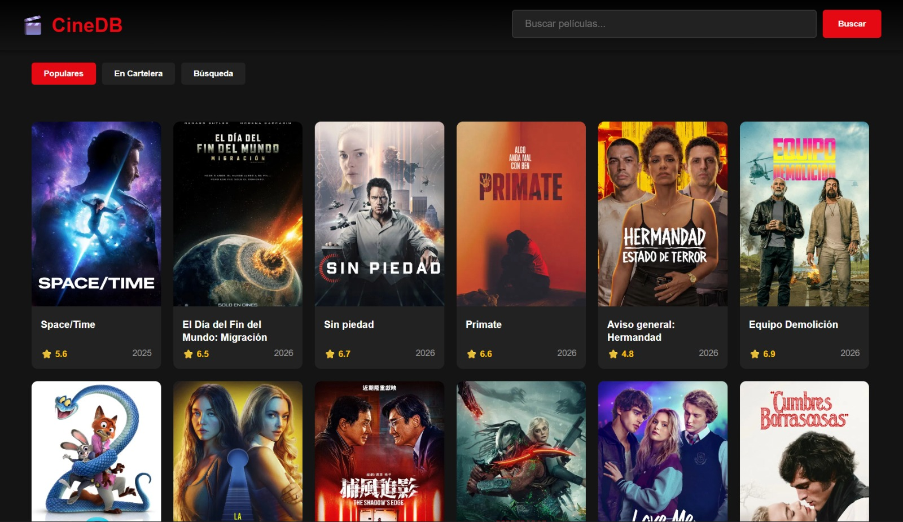

# 🚀 Ejercicios Prácticos de APIs con Flask

**Colección de 10 aplicaciones web completas usando Python Flask y diferentes APIs públicas**

## 🎯 Ejercicios

| # | Proyecto | Backend | Frontend | Descripción |
|---|----------|---------|----------|-------------|
| 1.1 | 🌍 Clima | [clima_app.py](ejercicio_1_1/clima_app.py) | [clima.html](ejercicio_1_1/templates/clima.html) | Detecta ubicación y muestra clima actual |
| 1.2 | 📍 Lugares | [lugares_app.py](ejercicio_1_2/lugares_app.py) | [lugares.html](ejercicio_1_2/templates/lugares.html) | Encuentra lugares cercanos (restaurantes, hospitales) |
| 2.1 | 🤖 Reddit | [reddit_app.py](ejercicio_2_1/reddit_app.py) | [reddit.html](ejercicio_2_1/templates/reddit.html) | Explora subreddits y busca posts |
| 2.2 | 🐙 GitHub | [github_app.py](ejercicio_2_2/github_app.py) | [github.html](ejercicio_2_2/templates/github.html) | Dashboard con estadísticas de usuarios/repos |
| 3.1 | 💾 CRUD API | [productos_api.py](ejercicio_3_1/productos_api.py) | [productos.html](ejercicio_3_1/templates/productos.html) | API REST completa con SQLite |
| 3.2 | 🔥 Chat | [chat_app.py](ejercicio_3_2/chat_app.py) | [chat.html](ejercicio_3_2/templates/chat.html) | Chat en tiempo real con Firebase |
| 4.1 | 📚 Libros | [libros_app.py](ejercicio_4_1/libros_app.py) | [libros.html](ejercicio_4_1/templates/libros.html) | Buscador de millones de libros |
| 4.2 | 💰 Divisas | [divisas_app.py](ejercicio_4_2/divisas_app.py) | [divisas.html](ejercicio_4_2/templates/divisas.html) | Conversor de monedas en tiempo real |
| 5.1 | 🎬 Películas | [peliculas_app.py](ejercicio_5_1/peliculas_app.py) | [peliculas.html](ejercicio_5_1/templates/peliculas.html) | Buscador de películas y series (TMDB) |
| 5.2 | 🎵 Spotify | [spotify_app.py](ejercicio_5_2/spotify_app.py) | [spotify.html](ejercicio_5_2/templates/spotify.html) | Buscador de música, artistas y álbumes |


---

## Evidencias

| Evidencia 1 | Evidencia 2 |
| :---: | :---: |
|  |  |
| **Evidencia 3** | **Evidencia 4** |
|  |  |
| **Evidencia 5** | **Evidencia 6** |
|  |  |
| **Evidencia 7** | **Evidencia 8** |
|  |  |
| **Evidencia 9** | **Evidencia 10** |
|  |  |

---
## 📁 Estructura del Proyecto
```
ejercicios-apis-flask/
├── README.md
├── LICENSE
├── .gitignore
├── requirements.txt
│
├── ejercicio_1_1/              # 🌍 Clima
│   ├── clima_app.py            # Backend Flask
│   └── templates/
│       └── clima.html          # Frontend
│
├── ejercicio_1_2/              # 📍 Lugares
│   ├── lugares_app.py
│   └── templates/
│       └── lugares.html
│
├── ejercicio_2_1/              # 🤖 Reddit
│   ├── reddit_app.py
│   └── templates/
│       └── reddit.html
│
├── ejercicio_2_2/              # 🐙 GitHub
│   ├── github_app.py
│   └── templates/
│       └── github.html
│
├── ejercicio_3_1/              # 💾 CRUD API
│   ├── productos_api.py
│   ├── productos.db            # Se crea automáticamente
│   └── templates/
│       └── productos.html
│
├── ejercicio_3_2/              # 🔥 Chat
│   ├── chat_app.py
│   ├── firebase-credentials.json  # Debes crearlo
│   └── templates/
│       └── chat.html
│
├── ejercicio_4_1/              # 📚 Libros
│   ├── libros_app.py
│   └── templates/
│       └── libros.html
│
|── ejercicio_4_2/              # 💰 Divisas
|   ├── divisas_app.py
|   └── templates/
|        └── divisas.html
├── ejercicio_5_1/          # 🎬 Películas TMDB
│   ├── peliculas_app.py
│   └── templates/
│       └── peliculas.html
└── ejercicio_5_2/          # 🎵 Spotify
    ├── spotify_app.py
    └── templates/
        └── spotify.html
```
## 👤 Autor

**Tu Nombre**
- GitHub: [ManuelTavares-sudo](https://github.com/ManuelTavares-sudo)
- Email: 1224100719.math@gmail.com

---
